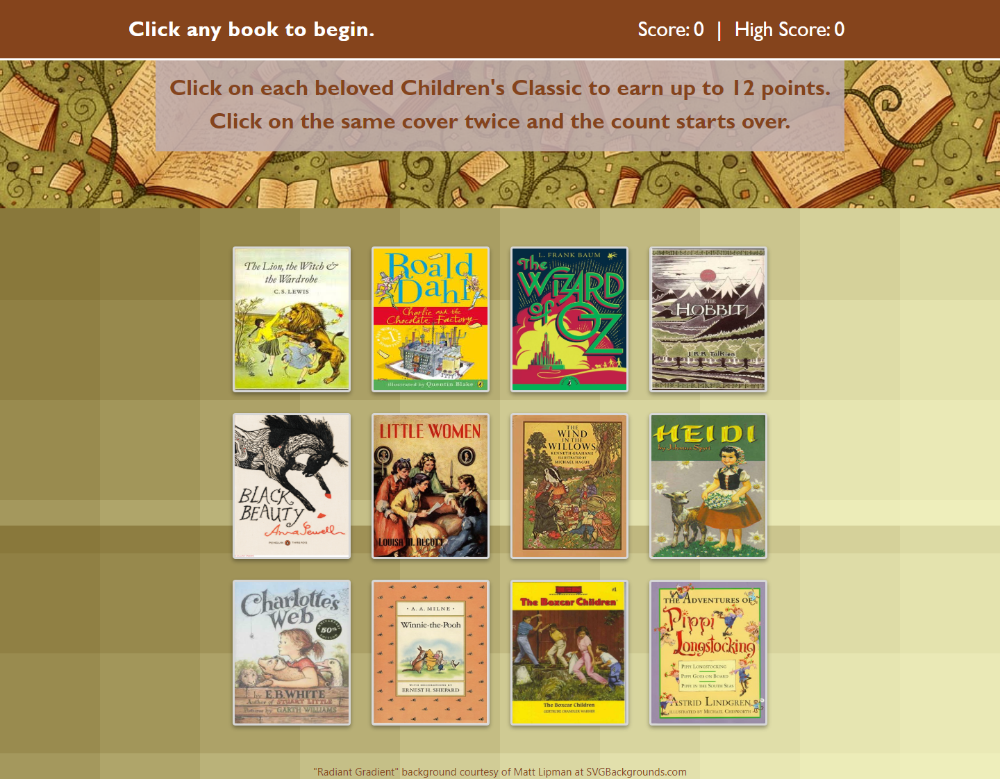
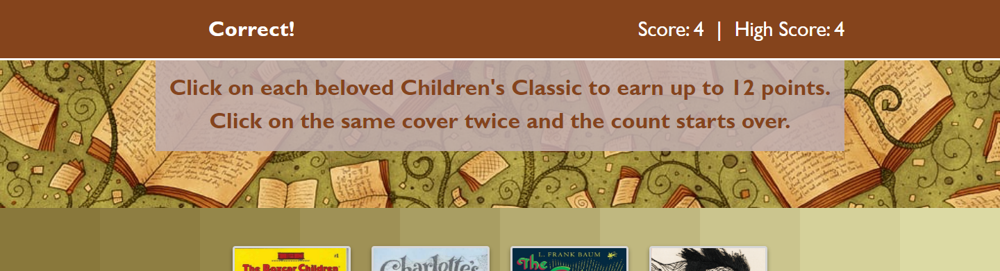
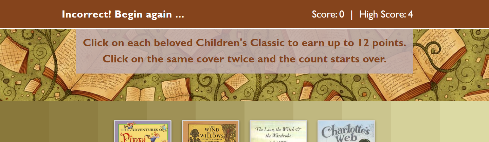

# Children's Classics Memory Game

A mobile-responsive app built with React and deployed through GitHub Pages 

created by Jennifer Gaumnitz
____________

GitHub Pages deployed app: https://jlgaumnitz.github.io/clicky-memory-game/

GitHub repository: https://github.com/JLGaumnitz/clicky-memory-game
- - - -

This memory game challenges users to click on book covers of Children's Classics without clicking on the same cover twice. The app uses React, React-DOM, and gh-pages. It was bootstrapped with the Create-React-App npm package.

### How You Can Get Started With This Web App ###

<strong>To use the app:</strong> 

Simply go to the GitHub Pages link above. 

Begin the game by clicking on any cover. Once you have clicked on one cover, the covers are reshuffled and you should click on a different cover. 

If you click on a different cover, the top bar displays "Correct!" in yellow fading to white, and the score is incremented by 1. 

If you click on the same cover twice, the covers shake (https://www.w3schools.com/howto/howto_css_shake_image.asp) and the top bar displays in orange fading to white "Incorrect! Begin again ... " and the Score resets to 0 and the High Score for this session is displayed. To reset the High Score to 0, refresh the browser window.

<strong>A few other notes:</strong>  
The "Radiant Gradient" background is courtesy of Matt Lipman at SVGBackgrounds.com.

The  artwork from the book covers is borrowed from various websites.

The site is mobile responsive, built with Bootstrap 4.0 and CSS with media queries.

### Creating the app from my files in my GitHub repository ### 

The last set of files in my repository are the files in the "build" folder, which was created to deploy my app to GitHub pages. If you wish to see the files and folders I used before that build, see my earlier commit (labeled "added info for deploying to github pages"). See the following section that contains the boilerplate README that will instruct you on how to run the create-react-app package and run the app locally with those files.

<!-- Boilerplate README from create-react-app-->
### Below is the boilerplate README information added by running create-react-app package to create this app ###
This project was bootstrapped with [Create React App](https://github.com/facebook/create-react-app).

## Available Scripts

In the project directory, you can run:

### `yarn start`

Runs the app in the development mode. 
Open [http://localhost:3000](http://localhost:3000) to view it in the browser.

The page will reload if you make edits. 
You will also see any lint errors in the console.

### `yarn test`

Launches the test runner in the interactive watch mode. 
See the section about [running tests](https://facebook.github.io/create-react-app/docs/running-tests) for more information.

### `yarn build`

Builds the app for production to the `build` folder. 
It correctly bundles React in production mode and optimizes the build for the best performance.

The build is minified and the filenames include the hashes. 
Your app is ready to be deployed!

See the section about [deployment](https://facebook.github.io/create-react-app/docs/deployment) for more information.

### `yarn eject`

**Note: this is a one-way operation. Once you `eject`, you can’t go back!**

If you aren’t satisfied with the build tool and configuration choices, you can `eject` at any time. This command will remove the single build dependency from your project.

Instead, it will copy all the configuration files and the transitive dependencies (Webpack, Babel, ESLint, etc) right into your project so you have full control over them. All of the commands except `eject` will still work, but they will point to the copied scripts so you can tweak them. At this point you’re on your own.

You don’t have to ever use `eject`. The curated feature set is suitable for small and middle deployments, and you shouldn’t feel obligated to use this feature. However we understand that this tool wouldn’t be useful if you couldn’t customize it when you are ready for it.

## Learn More

You can learn more in the [Create React App documentation](https://facebook.github.io/create-react-app/docs/getting-started).

To learn React, check out the [React documentation](https://reactjs.org/).

### Code Splitting

This section has moved here: https://facebook.github.io/create-react-app/docs/code-splitting

### Analyzing the Bundle Size

This section has moved here: https://facebook.github.io/create-react-app/docs/analyzing-the-bundle-size

### Making a Progressive Web App

This section has moved here: https://facebook.github.io/create-react-app/docs/making-a-progressive-web-app

### Advanced Configuration

This section has moved here: https://facebook.github.io/create-react-app/docs/advanced-configuration

### Deployment

This section has moved here: https://facebook.github.io/create-react-app/docs/deployment

### `yarn build` fails to minify

This section has moved here: https://facebook.github.io/create-react-app/docs/troubleshooting#npm-run-build-fails-to-minify

### (Note: This is the end of the boilerplate README information added by running create-react-app package to create this app.)
-----

### Why the Project is Useful ###

  The app fulfills a homework assignment for University of Kansas Coding Boot Camp, August 2019 to February 2020. The assignment allowed me to work with React for the first time and was also the first time to deploy a React app to GitHub pages.

### Where Users Can Get Help with This Project ###

  Questions? Contact Jennifer Gaumnitz at jlgaumnitz@gmail.com

### Who Maintains and Contributes to the Project ###

  Jennifer Gaumnitz created the project. I probably will not update it again after completing this assignment. 

